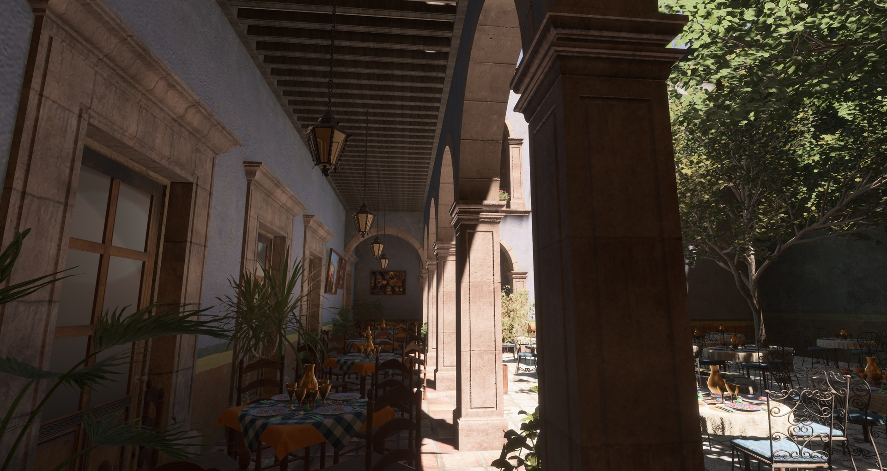
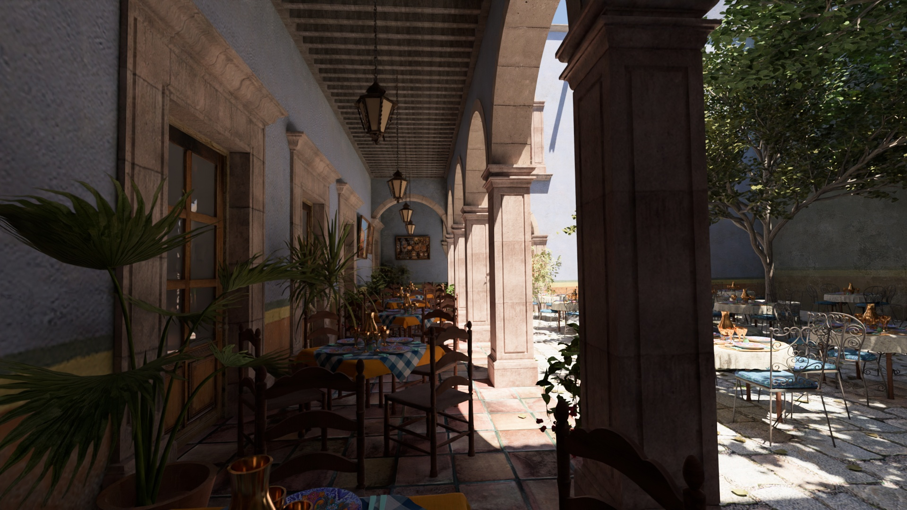

# Bevy San Miguel Example Scene

GLTF Version: [Discord](https://discord.com/channels/691052431525675048/692648638823923732/1173806749413822514)

Extract the files into `./assets/san-miguel/`

Original obj: [San Miguel 2.0](https://casual-effects.com/data/index.html).

*The GLTF version includes some fixes, mostly to get foliage to render correctly*



No GI, just aiming lights where there should be light.

**Note:** Conversion for BC7 compression below is not currently working. The default PNGs have to be used for now instead.
```
thread 'Compute Task Pool (12)' panicked at 'range end index 891904 out of range for slice of length 890832', [...]\.cargo\registry\src\index.crates.io-6f17d22bba15001f\wgpu-0.17.1\src\util\device.rs:130:22
```

To optionally convert the textures to KTX2 use: `cargo run -- --convert`. You need [kram](https://github.com/alecazam/kram) in your path to do this. It will convert all the textures to BC7 KTX2 zstd 0 using `available_parallelism()` and update the gltf files to use the KTX2 textures.


--------

Pathtraced reference used for setting up lights:

*Blender/Cycles*

(Note: I didn't setup the transmission on the leaves in blender and only roughly matched the sun/camera angles)
